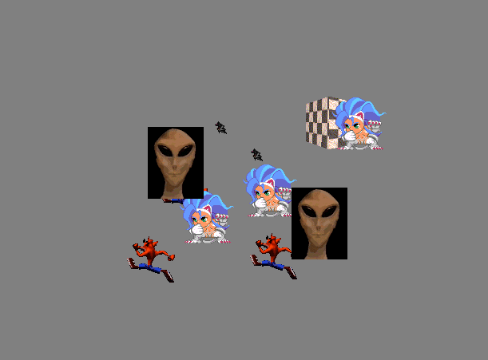

# Toybox

An easy script for making a box full of toys!

Just include toybox.js at the bottom of your page, and make sure you have one element with id="toybox" and all the child elements will be animated.

If you dont want to deal with github, you can click on toybox.js in the list of files and copy the code out yourself.